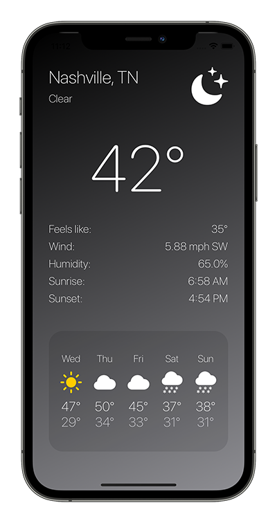

# Scott Quintana · iOS Portfolio
- Resume: [Download](https://scottquintana.com/resume.pdf)
- Email: dev@scottquintana.com
- Website: http://www.scottquintana.com
- LinkedIn: [https://www.linkedin.com/in/scottquintana/](https://www.linkedin.com/in/scottquintana/)
- Instagram: [@scottquintana](https://www.instagram.com/scottquintana/)
#
# Active Dispatch
Active Dispatch connects you to the Metro Nashville Police Department via their public API and displays all active police calls. The active calls are viewable in a list and via a map view. The individual incidents are assigned a color, depending on their category and threat level. When using the map view, clicking on the individual incidents offers a specific location and more information. Active Dispatch utilizes UIKit, however, the inspiration came through some recent SwiftUI projects (programmatic UI, gradients, reactive color changes, and the MVVM architecture).

<a href="https://github.com/scottquintana/NashvilleActiveDispatch">View GitHub Repo</a>

&nbsp;&nbsp;&nbsp;&nbsp;&nbsp;&nbsp;

# Cart Flow
Cart Flow was born out of a personal need for efficiency in grocery shopping in the time of COVID. This app was developed specifically in mind to add both custom items to your list and the assigned aisles each product can be found in. By listing items by aisle, you can spend less time trying to find each item and less time in the grocery store. This app utilizes Core Data and Diffable Data Sources.

<a href="https://github.com/scottquintana/CartFlow">View GitHub Repo</a>

&nbsp;&nbsp;&nbsp;&nbsp;&nbsp;&nbsp;

# WeatherApp
WeatherApp was my excuse to use a combination of technologies that I really enjoy: SwiftUI and Combine. Having a UI that could quickly react to whatever data might be coming it's way was easy to implement with this pairing, and with Core Location being integrated too, there is no setup involed. You simply open the app, it detects where you are, and gives you the corresponding weather. Once finished with the main app, I thought it would be fun to make a widget to go along with it, allowing you to see your hourly forecast whenever you look at your home screen.

<a href="https://github.com/scottquintana/WeatherApp-SwiftUI">View GitHub Repo</a>

&nbsp;&nbsp;&nbsp;&nbsp;&nbsp;&nbsp;

# Top Headlines
Top Headlines simplifies the news experience by showing you one story at a time, similarly to dating apps. Dependent on the users’ interest in the headline, they can use the buttons on the bottom of the UI or a swipe gesture to add to their reading list or pass the story. Once the feed of headlines has been exhausted, you can switch to your list, read each article, and check them off as you go.

<a href="https://github.com/scottquintana/TopHeadlines">View GitHub Repo</a>

&nbsp;&nbsp;&nbsp;&nbsp;&nbsp;&nbsp;

